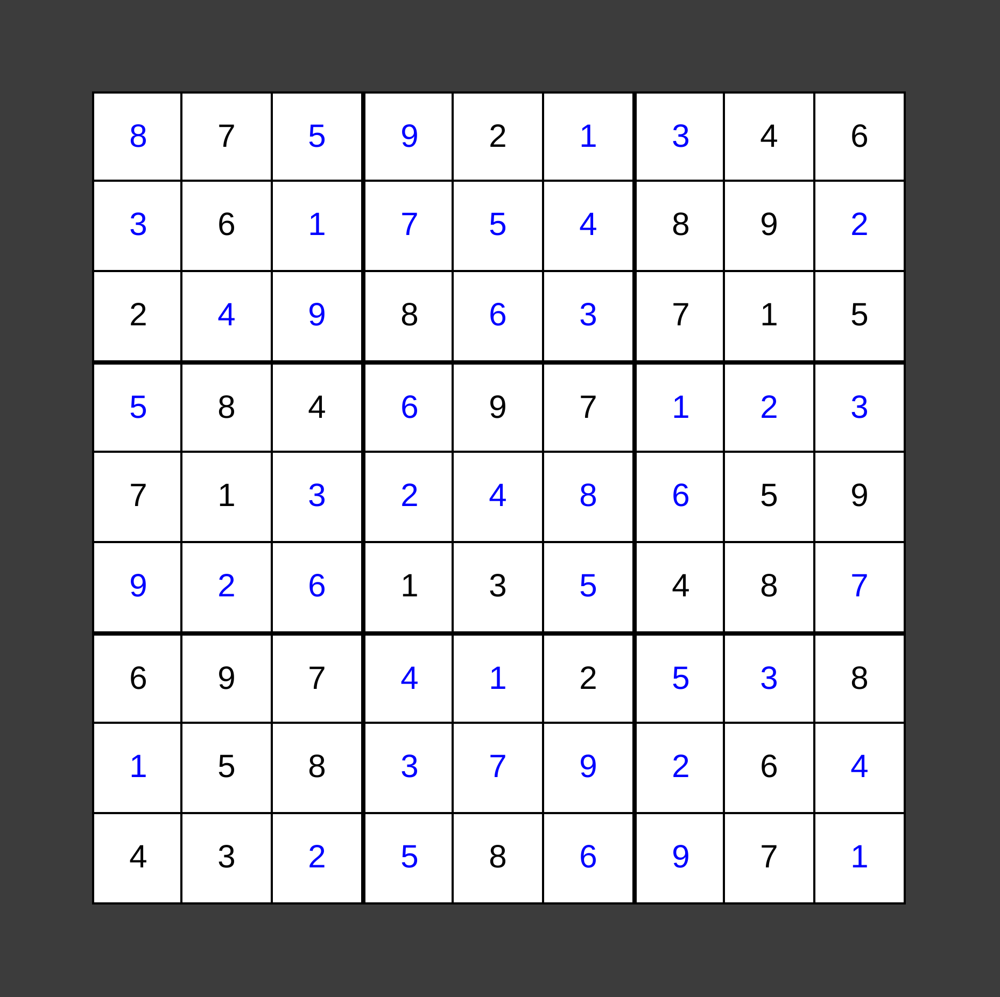

This is an old project I coded when I was 13. Enjoy!

This Sudoku solver solves most Sudokus in under a second! Click on a field to edit it. To navigate you can use the <kbd>WASD</kbd> or arrow keys, and to delete an entry press <kbd>BACKSPACE</kbd>. The program automatically detects known errors and warns you before solving, but if you enter a Sudoku with multiple solutions, it takes the first best one. To enter a new Sudoku you have to reload the page.
