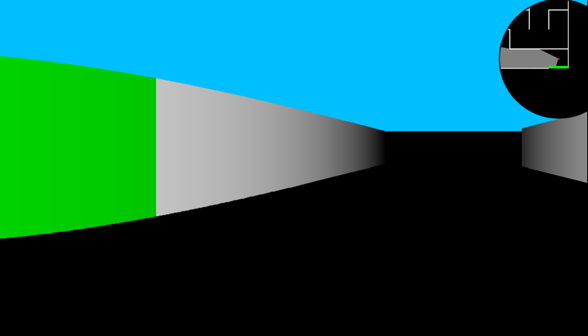

A maze app, which was my first real 3D project I coded when I was 12 and features random progressive maze generation and pseudo-3D-rendering using raycasting. You can double-click on the screen to go into fullscreen mode, and press <kbd>M</kbd> to open the map. You start from the green wall and have to get to the yellow wall by navigating with <kbd>WASD</kbd> or arrow keys.

Enjoy!
