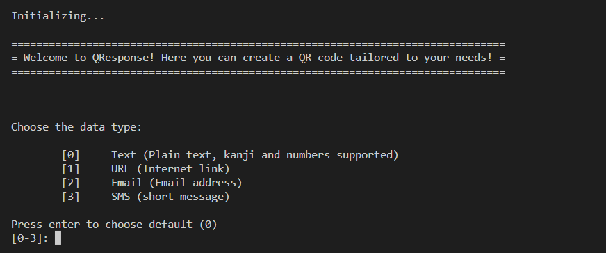

A QR Code generator I coded as an assignment in school when we learned python. Usage instructions and development hurdles are documented in the [README file](https://github.com/tasamo23/QResponse/blob/main/README.md).

The program generates QR Codes using different input data. Input of the parameters is done through the console, and there are a lot of different customization parameters than can be changed by the user manually.